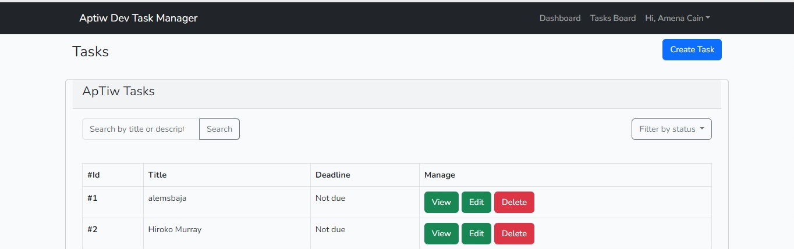
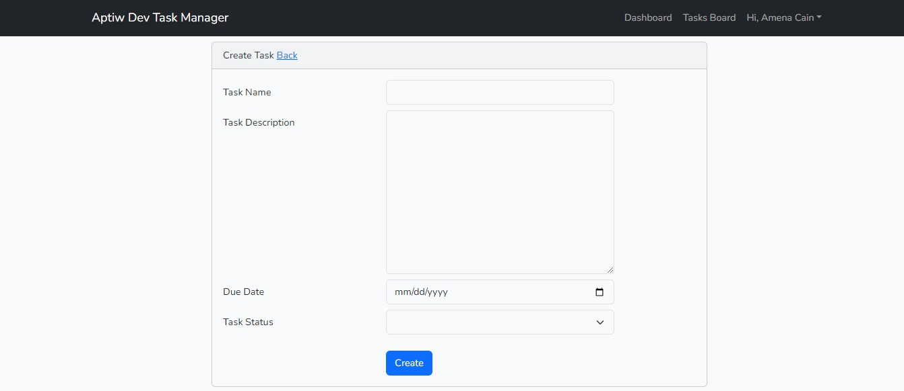

# My Task Manager 
    ```
    This is my  task manager coding interview to demonstrate the usage of Laravel best practices, Vuejs, GraphQL, and authentication for users.
    ```

# Project 
```
    The project is built using Laravel 9, GraphQL, Javascript, and Vuejs with Vite as the bundling tool.
```

# How to setup project locally
```
    The project can be setup locally by running the following commands
```

    - composer install

    - cp .env.example .env

    - php artisan key:generate

    - php artisan migrate

    - npm install

    - npm run dev

    - php artisan serve

    - composer test








